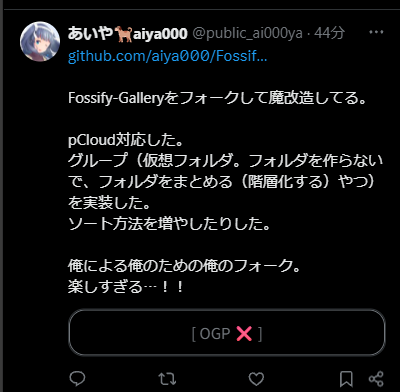

# tampermonky-x-block-ogp-card

A Tampermonkey userscript that replaces link preview (OGP) cards on X (Twitter) with a plain placeholder.

By default only `github.com` cards are replaced, so star counts and repository blurbs stop being pushed into your timeline. Any other domain can be added.

```
before:  ┌──────────────────────────┐
         │ [ a big preview image ]  │
         │ github.com               │
         │ owner/repo: description  │
         │ ★ 12.3k                  │
         └──────────────────────────┘

after:   ┌──────────────────────────┐
         │        [  OGP ❌️  ]      │
         └──────────────────────────┘
```

## Features

- **Domain allowlist** — Only the domains you list are replaced. Subdomains are covered too, so `github.com` also blocks `gist.github.com`
- **Still clickable** — The placeholder opens the original link in a new tab
- **CSS only** — The card's DOM is never rewritten, so X's React re-renders do not bring the card back
- **SPA-aware** — Reacts to X's client-side updates via `MutationObserver`, coalesced with `requestAnimationFrame`

## Screenshot

<!-- NOTE: Emulated 400px width in Chrome DevTools -->

A `github.com` card on a profile timeline, replaced by the placeholder:



## Installation

1. Install [Tampermonkey](https://www.tampermonkey.net/) in your browser (or Violentmonkey / Greasemonkey)
2. Open [`x-block-ogp-card.user.js`](https://raw.githubusercontent.com/aiya000/tampermonky-x-block-ogp-card/main/x-block-ogp-card.user.js)
3. Tampermonkey will prompt you to install the script — click **Install**

### On a phone

Mobile Chrome cannot run extensions, so one of these is needed:

- **Android**: Firefox for Android, plus the Tampermonkey add-on
- **iOS**: Safari, plus the [Userscripts](https://apps.apple.com/app/userscripts/id1463298887) app

Then open the raw URL above in that browser.

## Configuration

Everything lives in the `config` object at the top of the script:

```js
const config = {
  blockedDomains: ['github.com'],
  placeholder: '[  OGP ❌️  ]',
  clickToOpen: true
}
```

| Key | Meaning |
|---|---|
| `blockedDomains` | Registrable domains whose cards are replaced. Subdomains are covered too |
| `placeholder` | The text shown instead of the card. It is used as a CSS `content` value, so keep it free of `'` and `\` |
| `clickToOpen` | When `true`, clicking the placeholder opens the original link in a new tab |

## How it works

X renders every link card as `[data-testid="card.wrapper"]`, and shows the source
host (`github.com`) as a bare text node inside it. The script looks for that host
name, and when it matches, marks the wrapper with a `data-ogp-blocked` attribute.

The rest is pure CSS:

```css
[data-ogp-blocked] > *    { display: none !important; }
[data-ogp-blocked]::after { content: '[  OGP ❌️  ]'; }
```

The DOM structure is deliberately left untouched. X is a React app, so a card
rebuilt by hand would be restored on the next re-render -- but React does not
manage `data-*` attributes it never set, so the marker survives.

## Development

`bun` + `tsc` (via `jsdoc`) + `eslint` + `prettier`, with no build step.

```console
$ bun install
$ bun run typecheck
$ bun run lint
$ bun run fix
```

## License

[MIT](./LICENSE)
